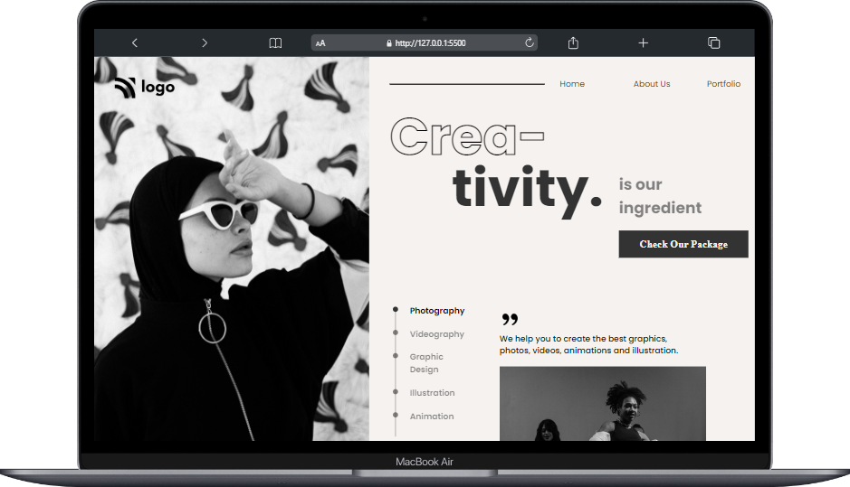
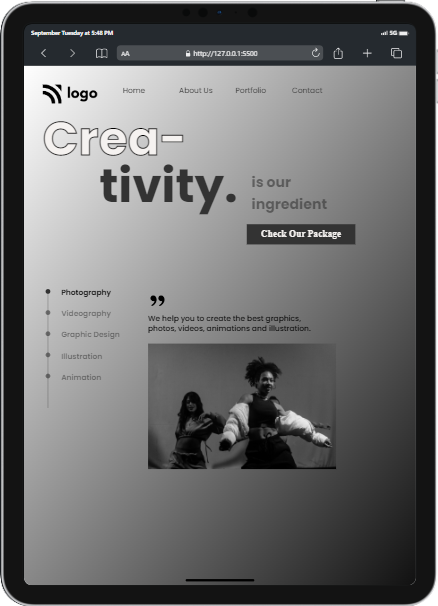
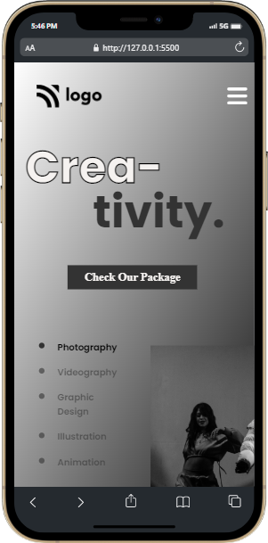
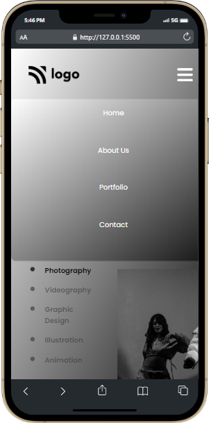
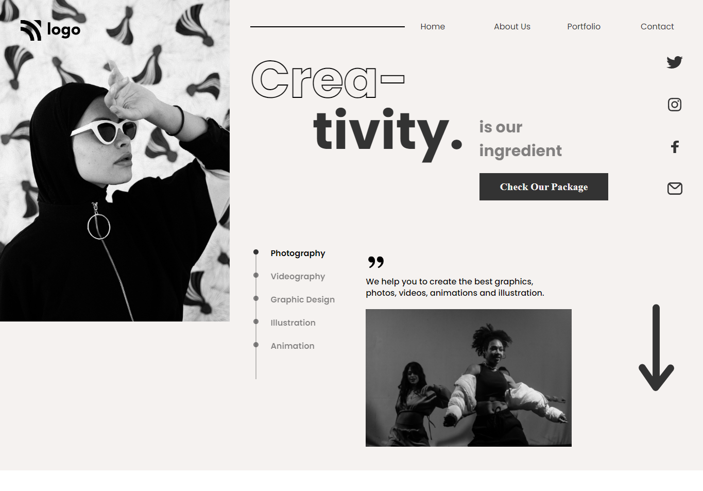

# Dance Home Page

***
## Description

This project [Dance Home Page]() was built using Semantic HTML and CSS from scratch. The main aim was to make the webpage based on the design provided and also make it responsive for all major devices. This project helped me in learning and brushing up concepts like **attribute-selectors**, **positions**, **text-stroke**, **pseudo classes :nth-child** and etc. The Project was completed under guidance of [Hitesh Choudhary](https://github.com/hiteshchoudhary), CTO Ineuron

***

### Links for Project

* [LIVE Project Link]()

* [Youtube Video Demo]()

* [Source Code]()

***
### Built With 

* Semantic HTML
* Custom CSS classes
* FlexBox
* Positions
* Media Queries

***

### Key Learnings

* Learned about **text-stroke-color** CSS property which specifies the stroke color of characters of text
* Learned about [attribute selectors](https://developer.mozilla.org/en-US/docs/Web/CSS/Attribute_selectors)
* Learned using [flexbox](https://developer.mozilla.org/en-US/docs/Web/CSS/flex)
* Learned to make webpage responsive with the help of [media queries](https://developer.mozilla.org/en-US/docs/Web/CSS/Media_Queries/Using_media_queries)

***

### Time Taken to finish this project
 

>2 hours to build it from scratch.

>1 hours to make it responsive

 

***

### Screencaptures of Project

 

1. #### Large Screen View 

   

  

 
 

  2. #### Tablet View 

   

  

   

   3. #### Mobile View

 

   

  4. #### Whole Webpage

   

  

   

***
 

### Checkout Portfolio & Other Projects

#### [Personal Portfolio]()

#### [Findcoder Profile]()
***

### Connect with Me
* [Mailto](mailto:shubhambhoj3@gmail.com)
* [LinkedIn]()
* [Github]()
* [Findcoder]()
***
***
[go to top](#dance-home-page)